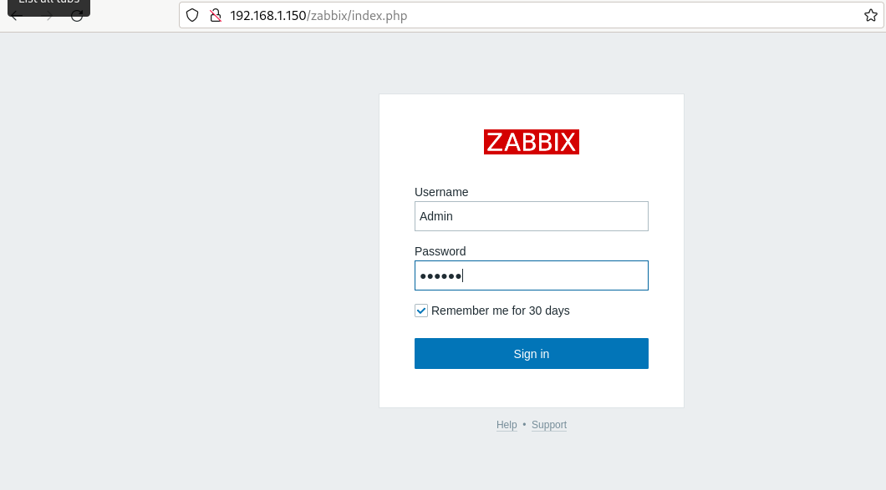
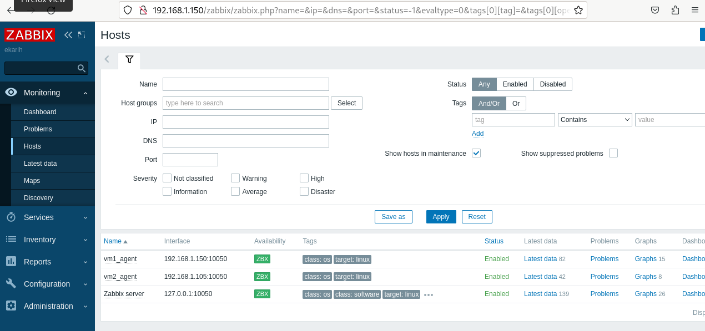
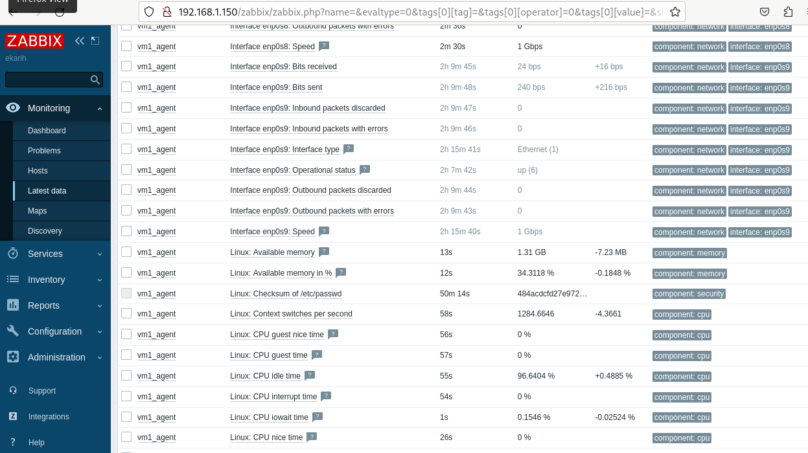
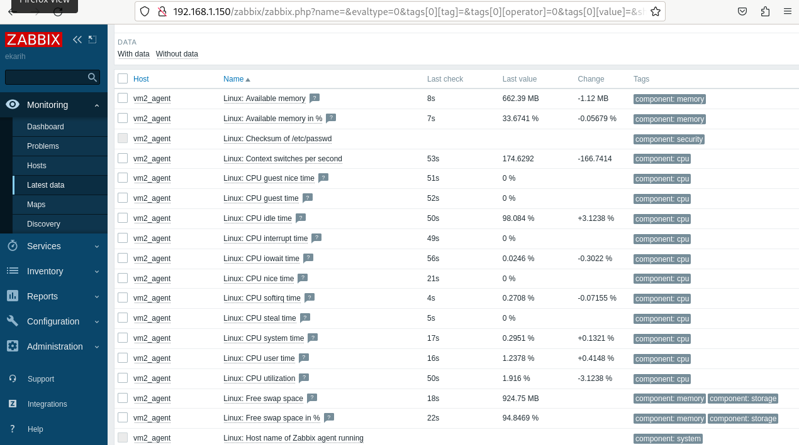

# Домашнее задание к занятию "`Система маниторинга Zabbix`" - `Карих Елена`
---
### Задание 1

1. Установила PostgreSQL: sudo apt install postgresql
2. Пользуясь конфигуратором команд с официального сайта, составьте набор команд для установки последней версии Zabbix с поддержкой PostgreSQL и Apache.
3. Выполните все необходимые команды для установки Zabbix Server и Zabbix Web Server:
   * sudo wget https://repo.zabbix.com/zabbix/6.0/debian/pool/main/z/zabbix-release/zabbix-release_6.0-5+debian12_all.deb
   * sudo dpkg -i zabbix-release_6.0-5+debian12_all.deb
   * sudo apt install zabbix-server-pgsql zabbix-frontend-php php8.2-pgsql zabbix-apache-conf zabbix-sql-scripts zabbix-agent 
   * sudo -u postgres createuser --pwprompt zabbix
   * sudo -u postgres createdb -O zabbix zabbix 
   * sudo zcat /usr/share/zabbix-sql-scripts/postgresql/server.sql.gz | sudo -u zabbix psql zabbix
   * Прописала пароль: DBPassword=123
   * sudo systemctl restart zabbix-server zabbix-agent apache2

Скрин авторизации:

---

### Задание 2

1. Установите Zabbix Agent на 2 вирт.машины: vm1 vm2
2. Добавьте Zabbix Server в список разрешенных серверов ваших Zabbix Agentов: Прописала Server=192.168.1.150 в zabbix_agentd.conf для агентов двух машин
3. Добавьте Zabbix Agentов в раздел Configuration > Hosts вашего Zabbix Servera.
4. Проверьте, что в разделе Latest Data начали появляться данные с добавленных агентов.

Configuration > Hosts:

